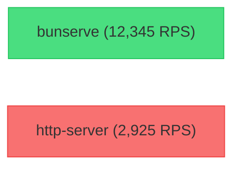
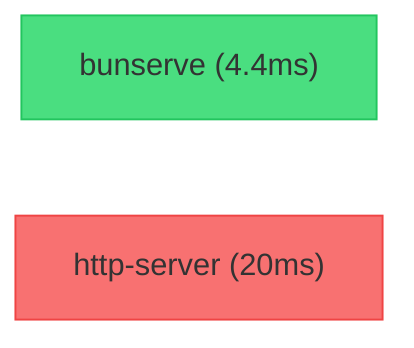

# ⚡️ Bunserve

**bunserve** is a lightning-fast, zero-config static file server built with [Bun](https://bun.sh/). It's designed to be the simplest way to serve your files over HTTP with modern performance and minimal footprint.

[](https://bun.sh)
[](https://opensource.org/licenses/ISC)
[]()

## 🚀 Features

- **⚡️ Blazing Fast**: Leverages Bun's native `serve` API for maximum throughput.
- **📦 Zero Config**: Start serving files instantly with a single command.
- **📁 Directory Listing**: Automatically generates a clean HTML listing for directories (if no `index.html` is present).
- **💾 Smart Caching**: Built-in memory caching for high-performance asset delivery.
- **📝 Advanced Logging**: Optional request logging to console or persistent files.
- **🛠 Customizable**: Fine-grained control over ports, hostnames, and root directories.

## 📦 Installation

You can run `bunserve` directly using `bunx`:

```bash
bunx bunserve
```

Or install it globally:

```bash
bun install -g bunserve
```

## 🛠 Usage

### Start serving the current directory
```bash
bunserve
```

### Serve a specific directory on a custom port
```bash
bunserve --dir ./dist --port 3000
```

### Enable caching and logging
```bash
bunserve --cache --logreq --savelog
```

## ⚙️ Configuration

| Parameter | Usage | Default |
| :--- | :--- | :--- |
| `--help` | View help screen | - |
| `--dir` | Directory you want to serve | Current Directory |
| `--port <number>` | Use a specific port | `8080` |
| `--hostname <string>` | Use a specific hostname | `0.0.0.0` |
| `--cache` | Enable in-memory caching | Disabled |
| `--logreq` | Log all incoming requests | Disabled |
| `--savelog` | Save logs to a file | Disabled |
| `--logfile` | Path to the logfile | `../bunserve-logs.txt` |

## 📊 Benchmarks

`bunserve` isn't just simpler—it's significantly faster and more stable under load.

### Performance Comparison
Benchmark conducted using `loadtest` with 60 concurrent clients for 10 seconds.

| Metric | `http-server` (Node.js) | `bunserve` (Bun) | Improvement |
| :--- | :--- | :--- | :--- |
| **Requests per Second** | 2,925 | **12,345** | **4.2x Faster** |
| **Mean Latency** | 20 ms | **4.4 ms** | **4.5x Lower** |
| **99% Latency** | 78 ms | **10 ms** | **7.8x Lower** |
| **Error Rate** | 33.8% | **0.0%** | **100% Stable** |

### Throughput (Requests per Second)


### Latency (Mean, Lower is Better)


## 🏗 Development

To run the project locally in development mode:

```bash
bun run dev
```

To build a minified production version:

```bash
bun run build
```

The output will be generated in the `dist/` directory.

## 📄 License

Distributed under the ISC License. See `LICENSE` for more information.

---

Built with ❤️ by [Sancho Godinho](https://sancho.sg-app.com/)
